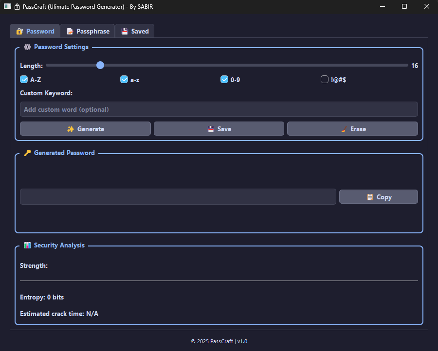
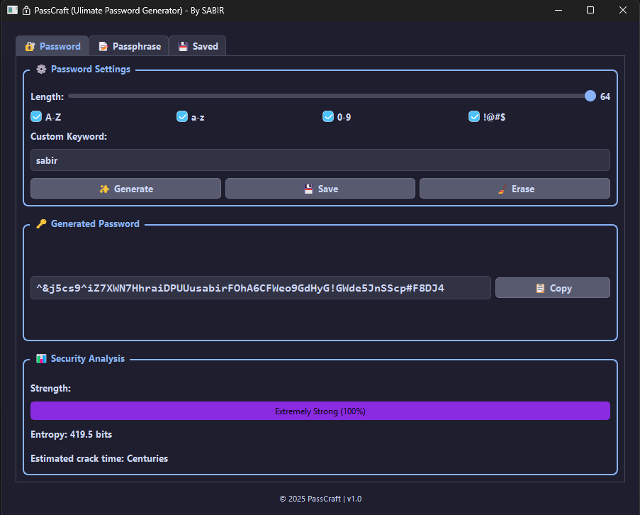

# PassCraft 🔐

*A powerful and efficient password generator built for security and ease of use.*

---

## 🚀 Features
PassCraft offers a wide range of functionalities to help users generate strong and customizable passwords efficiently.

### 🔑 **Core Features:**
✅ **Instant Password Generation** – Quickly generate secure passwords with various options.  
✅ **Customizable Length** – Set your desired password length (from short to very long).  
✅ **Character Set Selection** – Choose from uppercase, lowercase, numbers, and special characters.  
✅ **Avoid Ambiguous Characters** – Option to exclude characters like `O`, `0`, `I`, and `l` for better readability.  
✅ **Password Strength Indicator** – Get real-time feedback on the security of the generated password.  
✅ **Save Generated Passwords** – Option to save passwords to a text file for future use.  
✅ **Copy to Clipboard** – Instantly copy passwords to the clipboard for quick access.  
✅ **Offline & Lightweight** – Works completely offline and has minimal resource usage.  

### 🔥 **Advanced Features:**
🚀 **Bulk Password Generation** – Generate powerful passwords.  
🔄 **Passphrase Generator** – Create secure yet easy-to-remember passphrases.  
🔒 **Entropy Calculation** – Get an estimate of password strength in bits.  
🎨 **User-Friendly Interface** – Clean and simple UI for easy navigation.  
📜 **Command-Line Support** – Run PassCraft from the terminal with arguments.  

---

## 📌 Installation

Clone this repository and navigate to the directory:

```bash
git clone https://github.com/Sabirtanvir12/PassCraft.git

cd PassCraft
```

Ensure you have Python installed, then run:
```bash
pip install PyQt6
```
## or
```bash
bash install.sh
```

---

## 🛠 Usage


### 🐧 Linux
Make the script executable:
```bash
chmod +x gen.py
```
Then run it:
```bash
python gen.py
```

### 💻 Windows
1. Download the ZIP file from GitHub and extract it.
2. Open the extracted folder.
3. Right-click inside the folder and select **Open in Terminal**.
4. Run the script using:
```powershell
python gen.py
```

## 🖥 Preview

Example output:
```
Generated Password: p@S5w0rD!8Xy*
```

### 📸 Screenshots
Below are some screenshots of PassCraft in action:





---

## 📄 License
This project is licensed under the MIT License. See the [LICENSE](LICENSE) file for details.

---

## 📞 Contact
For any issues or suggestions, feel free to contact:
- **GitHub:** [Sabirtanvir12](https://github.com/Sabirtanvir12)
- **Email:** [sabirtanvir10@gmail.com](mailto:sabirtanvir10@gmail.com)

---

⭐ **Star the repo if you find it useful!** ⭐
